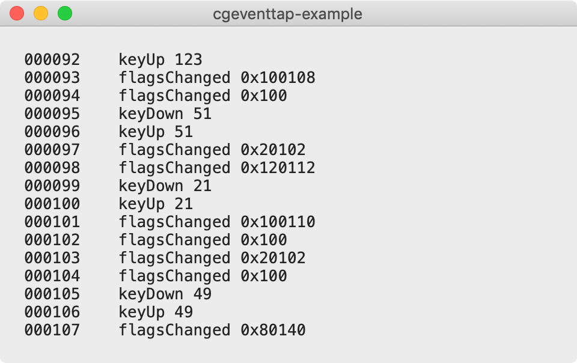
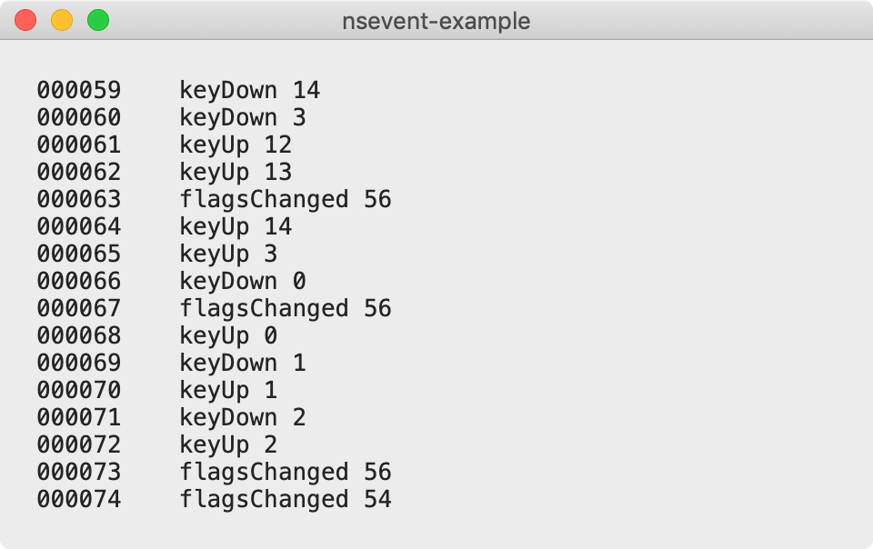

[](https://github.com/pqrs-org/osx-event-observer-examples/blob/main/LICENSE.md)

# osx-event-observer-examples

- cgeventtap-example
  - `CGEventTapCreate`
  - 
- iokit-hid-report-example
  - `IOHIDDeviceRegisterInputReportCallback`
  - 
- iokit-hid-value-example
  - `IOHIDQueueRegisterValueAvailableCallback`
  - 
- nsapplication-example
  - `[NSApplication sendEvent]`
  - 
- nsevent-example
  - `[NSEvent addGlobalMonitorForEvents]`
  - (Equivalent to `CGEventTapCreate` but cannot modify received events)
  - 
- nsview-example
  - `[NSView keyDown]`
  - 

---

## Related documentation

[All about macOS event observation](https://docs.google.com/presentation/d/1nEaiPUduh1vjks0rDVRTcJaEULbSWWh1tVdG2HF_XSU/edit#slide=id.p)

---

## System requirements

- macOS 10.13 or later

---

## Building example apps

### Requirements

- CMake (`brew install cmake`)

### Steps

1.  Find your codesign identity if you have one.<br />
    (Skip this step if you don't have your codesign identity.)

    ```shell
    security find-identity -p codesigning -v | grep 'Developer ID Application'
    ```

    The result is as follows.

    ```text
    1) 8D660191481C98F5C56630847A6C39D95C166F22 "Developer ID Application: Fumihiko Takayama (G43BCU2T37)"
    ```

    Your codesign identity is `8D660191481C98F5C56630847A6C39D95C166F22` in the above case.

2.  Set environment variable to use your codesign identity.<br />
    (Skip this step if you don't have your codesign identity.)

    ```shell
    export PQRS_ORG_CODE_SIGN_IDENTITY=8D660191481C98F5C56630847A6C39D95C166F22
    ```

3.  Build `dist/osx-event-observer-examples.dmg` by the following command on terminal.

    ```shell
    make dist
    ```

---

## Note

User approval of Accessibility is required to use cgeventtap-example and nsevent-example.
(User approval of Input Monitoring is also required since macOS 10.15)


User approval of Accessibility and Input Monitoring is required
to use `iokit-hid-value-example` since macOS 10.15.


