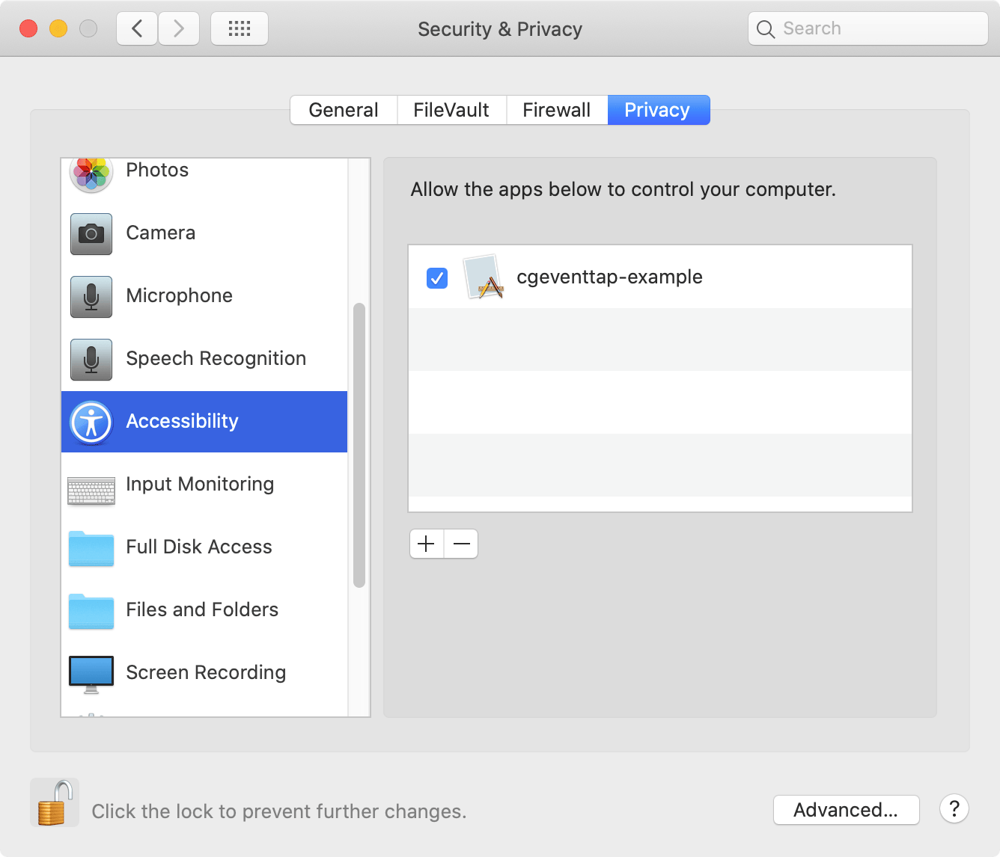

# osx-event-observer-examples

- cgeventtap-example
  - `CGEventTapCreate`
- iokit-hid-value-example
  - `IOHIDQueueRegisterValueAvailableCallback`
- nsapplication-example
  - `[NSApplication sendEvent]`
- nsevent-example
  - `[NSEvent addGlobalMonitorForEvents]`
  - (Equivalent to `CGEventTapCreate` but cannot modify received events)
- nsview-example
  - `[NSView keyDown]`

---

## System Requirements

- macOS 10.12 or later

---

## Building example apps

### Requirements

- CMake (`brew install cmake`)

### Instructions

Open terminal and execute `make` command.

---

## Note

User approval of Accessibility is required to use cgeventtap-example and nsevent-example.
(User approval of Input Monitoring is also required since macOS 10.15)

User approval of Accessibility and Input Monitoring is required
to use `iokit-hid-value-example` since macOS 10.15.

